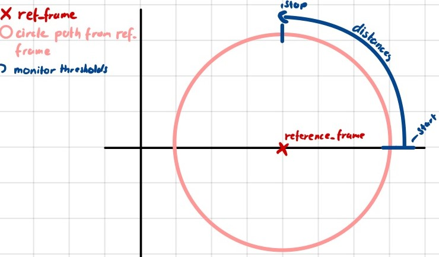
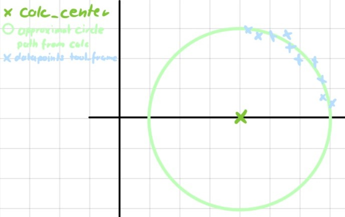
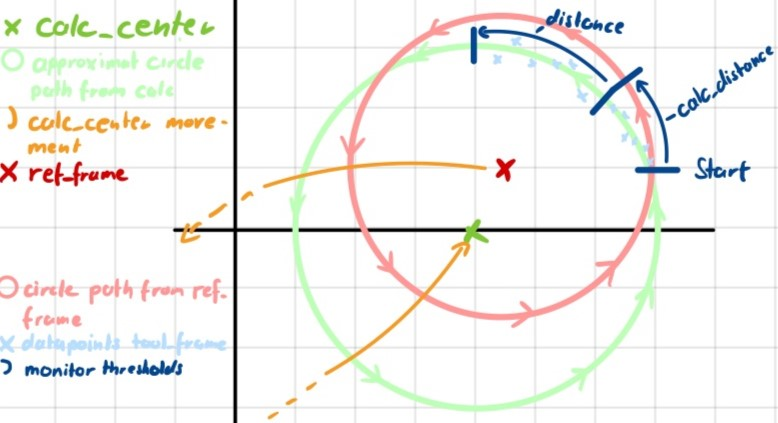

# Door Opening Package for Pitasc

This package includes the door opening skill as well as the scripts and monitors created for it. The goal of the
door opening skill is to open a door with a smooth motion by reducing forces against the tool. 

This package includes the following scripts, monitors and skills
- [script_temp_frame_offset](#script_temp_frame_offset)
- [script_temp_frame_center_of_circle](#script_temp_frame_center_of_circle)
- [monitor_relative_angular_distance](#monitor_relative_angular_distance)
- [skill_door_opening](#skill_door_opening)

## monitor_relative_angular_distance

A monitor that looks at the rotation of a frame around the reference frame. Created to circumvent the problem with
the monitor **monitor_distance** that only calculates the rotational change of the frame.

### functionality

 

Monitor calculates the angle between the starting and current position of the observed `frame` around a static
`reference_frame`. Reduces the problem into a 2D problem by removing the in `coordinates` selected axis and
assuming every data point is in the same plane. Only the position, and not the rotation of the observed frame,
is relevant for the monitor. Triggers when the rotation around the in `coordinates` selected axis exceeds/passes
a certain threshold depending on the `operator` set. Every coordinate is handled individually. Triggers if true for
every coordinate.

### parameter

**reference_frame**
\
A static frame around which the moving frame rotates

**frame**
\
Moving/Observed frame

**coordinates**
\
Observed axes. The axis of the reference_frame which the angle is calculated around.

**distances**
\
Distances threshold [rad] from 0 to 2 * Pi. The monitor triggers after passing or exceeding, depending on the
operator, this distance threshold. Aligned to the `coordinates` member.

**operator**:
\
The operator determines if the monitor triggers by comparing the distance threshold with the calculated distance.
The suggested value is "crossing_threshold" which makes the determination of the `distances` parameter simpler.
Also usable are "greater", "less", "absolute_greater", "absolute_less"

**dead_zone**: default: 0.001
\
Distance, in [rad], of zone around the starting position the monitor ignores. It is needed to ignore the potential
overflow of the distance parameters at the start of a rotation caused by a small imprecision of the robot.

## script_temp_frame_offset
A script that creates a temp frame that copies the position of a source frame and adds an offset to it

### functionality

This script is a copy of the script_temp_frame that is implemented in pitasc by default with the addition of an
offset variable. The user sets a `parent` frame that sets up the reference coordinate system and a `source` frame
which determines the initial position of the temp frame. The offset is added to the `source` frame.

### parameter

**frame:**
\
Name of the frame to be created

**source:**
\
Name of the frame from which the initial position is copied

**parent:**
\
Name of the parent frame of `frame`

**offset:** Default: 0,0,0,0,0,0
\
Offset of the new frame relative to the `source` frame

## script_temp_frame_center_of_circle

Creates a temporary frame and moves it to the center point of a frame that moves in a circular path.

### functionality

 

The z-axis of the source frame plus offset is assumed to be perpendicular to the plane of rotation. Uses the x, y
positional values of the observed frame relative to the source frame plus offset to approximate the x and y
position of the temp frame. The z position is set to 0. Uses the Taubin Circle Fit Method for finding the center
point. The frame's position will be updated as long as the script is active.

### parameter

***Every parameter of script_temp_frame_offset**
\
This script inherits from script_temp_frame_offset.

**tool_frame**
\
The name of the frame the data points are taken from.

## skill_door_opening

### functionality

 

The functionality of this skill can be separated into two parts, the initial rotation and the follow-up rotation.
At the beginning, the skill creates two new frames called **ref_frame** and **calc_center** at the position and
orientation of the `source_frame` plus the `offset`. The `tool_frame` starts rotating around the z-axis of the
`ref_frame` and starts calculating the position of the **calc_center** using the
**script_temp_frame_center_of_circle** script. After the `tool_frame` passes the `calc_distance` threshold, this
initial step gets aborted and the second step starts. Now the `tool_frame` no longer rotates around the `ref_frame`
but the `calc_center` frame. The position of the `calc_center` frame still continues to be updated by the
**script_temp_frame_center_of_circle** script. After the `tool_frame` passes the `distance` threshold, the skill is
completed and the rotation stops. Throughout this whole process, the forces on the corresponding axis of the
`tool_frame` are set to 0 so that the `tool_frame` moves according to the door rotation.

### parameter

**tool_frame:**
\
Moving/Observed frame

**parent_frame:**
\
The name of the parent frame of the `source_frame` and the created **calc_center** frame

**source_frame:**
\
The name of the frame from which the initial position is copied

**offset:** default: 0, 0, 0, 0, 0, 0
\
Offset of the new frame relative to the `source_frame` frame

**force_axes:** default: x
\
List of axes

**target_forces:** default: 0
\
Forces and torques to be applied. Must be the same number of values as for `force_axes`.

**compliance:** default: 0.002
\
Force controller gain

**corner_frequency:** default: 5.0
\
Force controller corner frequency

**velocities:** default: 0, 0.1, 0, 0, 0, 0
\
The speed at which the tool frame moves.
**Only change the second value of the CSV. Every other value has to be 0**

**distance:** default: 1.31
\
The second distances threshold [rad] from 0 to 2 * Pi that is used to approximate the center position after the
initial step. The monitor triggers after passing this distance threshold. Aligned to the the  z-axis of the
`source_frame` plus `offset`.

**distance_calc:** default: 0.26
\
The initial distances threshold [rad] from 0 to 2 * Pi is used to approximate the center position with the
first few positional values of the initial movement. The monitor triggers after passing, this distance threshold.
Aligned to the z-axis of the `source_frame` plus `offset`.

**monitor_dead_zone:** default: 0.001
\
Distance, in [rad], of zone around the starting position the monitor ignores. It is needed to ignore the potential
overflow of the distance parameters at the start of a rotation caused by a small imprecision of the robot.